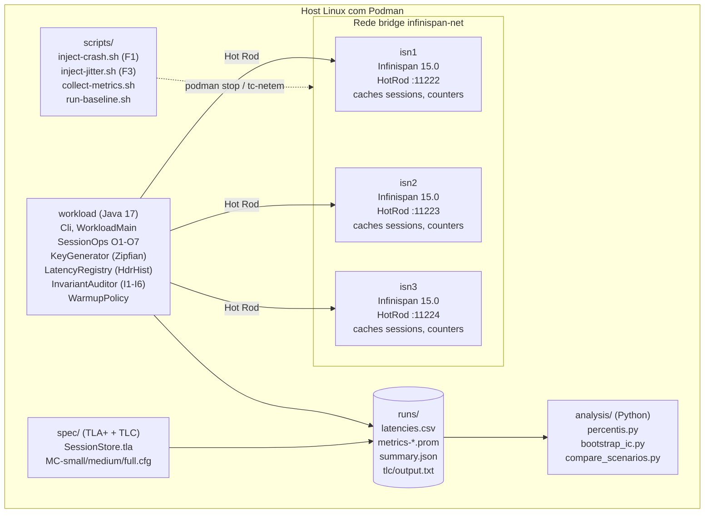
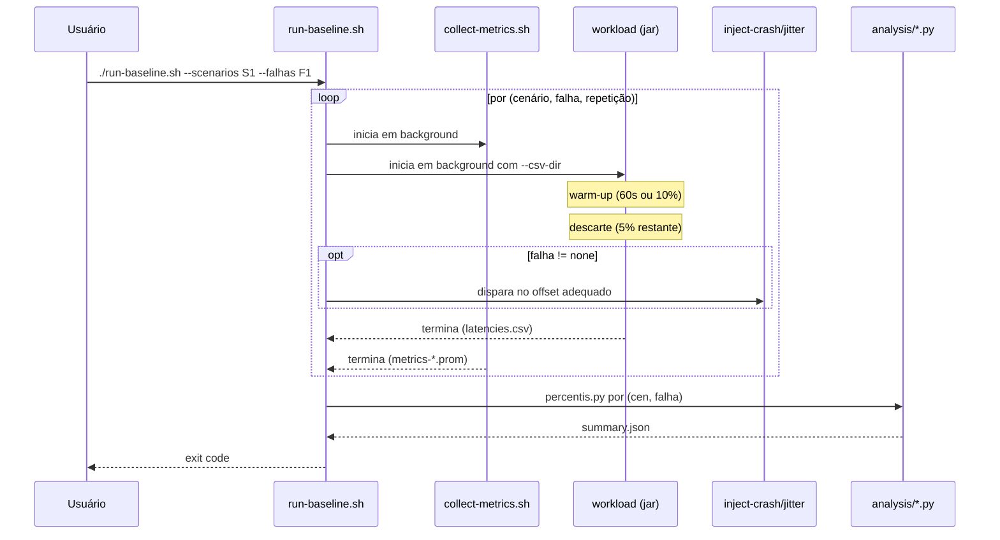

# tcc-desenvolvimento

Protótipo experimental do Trabalho de Conclusão de Curso de Francesco Pagani Galvão, Bacharelado em Engenharia de Computação, Universidade Federal do Pampa (UNIPAMPA, Campus Bagé), sob orientação do Prof. Dr. Leonardo Bidese de Pinho.

**Tema:** Verificação formal de invariantes de sessão em *data grids*: replicação assíncrona, *failover* e controle orientado a SLO.

Este repositório materializa a frente experimental do trabalho. A frente teórica (mapeamento sistemático, fundamentação, redação) é mantida fora deste repositório e consome este código exclusivamente por meio dos resumos técnicos em [`docs/resumos-para-tcc/`](docs/resumos-para-tcc/).

## Vínculo com o TCC

A Tabela 1 do Capítulo 3 §3.3.5 da monografia (*Parâmetros experimentais e fundamentação na literatura*) fixa, em 22 linhas T1 a T22, os parâmetros operacionais do *baseline*. Este repositório realiza cada linha de forma observável e reproduzível. A cobertura consolidada está em [`docs/resumos-para-tcc/13-cobertura-tabela1.md`](docs/resumos-para-tcc/13-cobertura-tabela1.md).

Resumo: 11 linhas em ✅ (implementado e testado), 10 em ⚠️ (implementado mas requer cluster vivo) e 1 em ❌ (T12 depende de calibração).

## Arquitetura



## Fluxo de uma execução de baseline



## Estrutura de pastas

```
tcc-desenvolvimento/
├── cluster/                # podman-compose.yml + infinispan-cluster.xml
├── workload/               # projeto Maven Java 17 (Hot Rod client)
├── scripts/                # injeção de falha, coleta, pipeline end-to-end
├── spec/                   # SessionStore.tla + cfg + runner TLC
├── analysis/               # parsing, percentis, bootstrap, Mann-Whitney
├── runs/                   # saídas brutas (.gitignore) + summary.json
├── docs/                   # documentação técnica + resumos para o TCC
│   ├── planejamento-inicial.md
│   ├── configuracao-infinispan.md
│   ├── implementacao.md
│   ├── spec-formal.md
│   ├── testes.md
│   ├── criterios-de-aceite.md
│   ├── pull-request-template.md
│   └── resumos-para-tcc/   # consumidos pelo trabalho acadêmico
├── README.md
├── CONTRIBUTING.md
├── LICENSE
└── .gitignore
```

## Início rápido

### Pré-requisitos

- JDK Temurin 17 (`java -version` deve mostrar 17.0.x)
- Maven 3.9+ (`mvn -v`)
- Podman + podman-compose (somente para subir o *cluster*)
- Python 3.11+ com `numpy` e `scipy` (para a análise)
- TLA+ tools (`tla2tools.jar`) para o *model checking*

### Compilar o *workload*

```bash
cd workload
mvn -q -DskipTests package
```

Gera `target/session-workload-0.1.0-SNAPSHOT.jar` (*shaded*, ~19 MB, mainClass `br.unipampa.tcc.session.WorkloadMain`).

### Rodar os testes

```bash
cd workload
mvn test
```

Cobertura JUnit atual: 34 testes (KeyGenerator, Scenario, WarmupPolicy, Cli, LatencyRegistry, InvariantAuditor).

### Subir o *cluster* Infinispan

```bash
cd cluster
podman-compose up -d
podman ps --filter "label=infinispan" --format "table {{.Names}}\t{{.Status}}"
```

### Rodar o *model checking* inicial

```bash
cd spec
./run-tlc.sh small         # configuração 2-2-2
./run-tlc.sh medium        # configuração 3-3-2
./run-tlc.sh full          # configuração 3-3-3
```

Logs em `runs/tlc/<size>/output.txt`.

### Executar o *baseline* completo

```bash
./scripts/run-baseline.sh --scenarios S1,S2 --falhas none,F1,F3 --rep 30 --duration 600
```

Saída em `runs/baseline-<TS>/<scen>/<falha>/rep-NNN/`. `--dry-run` lista as combinações previstas.

## Fluxo de desenvolvimento

O trabalho neste repositório segue um protocolo estruturado em quatro passos, descrito em [`docs/planejamento-inicial.md`](docs/planejamento-inicial.md):

1. **Planejamento técnico** de cada incremento, com critérios de aceite ([`docs/criterios-de-aceite.md`](docs/criterios-de-aceite.md)) e *branch* nominal.
2. **Aprovação do autor** antes da execução.
3. **Implementação** em *branch* específica, com testes ([`docs/testes.md`](docs/testes.md)) e documentação técnica.
4. **Revisão e validação do autor** antes de qualquer *push* para `origin/*` (política de *push* exige aprovação explícita por entrega ou em lote por *branch*).

Resumos técnicos das entregas são depositados em [`docs/resumos-para-tcc/`](docs/resumos-para-tcc/) para alimentar a escrita do TCC. Detalhes em [`CONTRIBUTING.md`](CONTRIBUTING.md).

## Estado atual

Snapshot em 2026-06-14:

- **`main`** consolidou as entregas dos blocos B-01 a B-04, B-14, B-15 e B-16 a B-18 (sete *pull requests* mergidos antes da revisão de política de 2026-06-14).
- **`feature/workload-operations`** = `main` + B-05 (PR #8 OPEN no remoto, aguardando *merge* do autor).
- **`feature/workload-latency`** = + B-06 (`HdrHistogram`).
- **`feature/workload-auditor`** = + B-07 (`InvariantAuditor`).
- **`feature/workload-load`** = + B-08 (`KeyGenerator` + `Scenario`).
- **`feature/workload-warmup`** = + B-09 (`WarmupPolicy`).
- **`feature/workload-cli`** = + B-10 (`Cli` Picocli).
- **`feature/falha-f1-crash`** = + B-11 (`inject-crash.sh`).
- **`feature/falha-f3-jitter`** = + B-12 (`inject-jitter.sh`).
- **`feature/metrics-collector`** = + B-13 (`collect-metrics.sh`).
- **`feature/pipeline-baseline`** = + B-19 (`run-baseline.sh`).
- **`docs/resumos-para-tcc`** = + 14 resumos cobrindo B-02 a B-19.
- **`docs/consolidacao-final`** (esta) = + atualização desta documentação (B-20).
- **`docs/objetivo-revisao`** (à parte) = revisão do `planejamento-inicial.md`.

**Frente formal:** executada. Cinco rodadas do TLC concluídas; resultados em `runs/tlc/`.

**Sandbox operacional:** OpenJDK Temurin 17, Maven 3.9.9, TLA+ tools, Python 3.11 + numpy + scipy em `~/tools/`. **Não disponível no sandbox:** Podman, `tc-netem` com `NET_ADMIN`, imagem `quay.io/infinispan/server:15.0`. Atividades dependentes ficam para a máquina do autor.

## Documentos relacionados

- [`docs/planejamento-inicial.md`](docs/planejamento-inicial.md) — objetivo, *backlog* B-01..B-20, decisões D-001..D-009.
- [`docs/implementacao.md`](docs/implementacao.md) — visão técnica do código.
- [`docs/configuracao-infinispan.md`](docs/configuracao-infinispan.md) — *cluster* e perfis SYNC/ASYNC.
- [`docs/spec-formal.md`](docs/spec-formal.md) — `SessionStore.tla` e configurações TLC.
- [`docs/testes.md`](docs/testes.md) — estratégia e cobertura de testes.
- [`docs/criterios-de-aceite.md`](docs/criterios-de-aceite.md) — critérios por bloco.
- [`docs/resumos-para-tcc/`](docs/resumos-para-tcc/) — resumos curtos por bloco para a escrita acadêmica.

## Licença

MIT. Ver [`LICENSE`](LICENSE).
