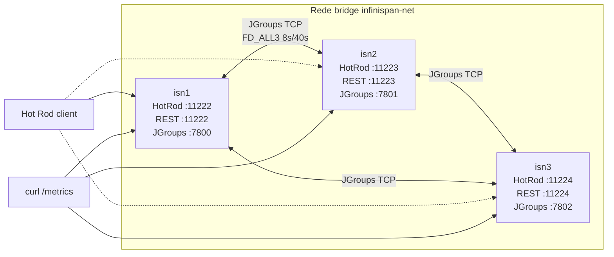
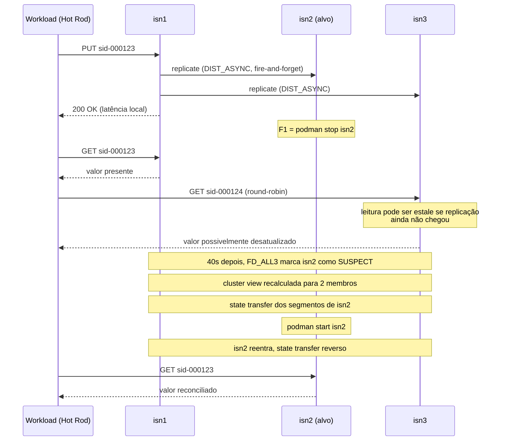

# Configuração do *cluster* Infinispan

> Documento técnico que descreve a configuração do *cluster* Infinispan empregada no protótipo do TCC. Mapeia cada decisão de configuração para a(s) linha(s) Tx da Tabela 1 do Cap. 3 §3.3.5 da monografia.

## Topologia



## Arquivos

| Arquivo | Função |
|---|---|
| `cluster/podman-compose.yml` | Orquestra três nós Infinispan em *containers* Podman, com rede *bridge* dedicada e *health check* via REST. |
| `cluster/infinispan-cluster.xml` | Define os *caches* `sessions` (perfil SYNC e perfil ASYNC) e `counters`, com partição tratada por `DENY_READ_WRITES`. |

A inicialização ocorre via `cd cluster && podman-compose up -d`. O *health check* é executado pelo Podman a cada 5 s; um nó é considerado saudável quando `GET /rest/v2/cache-managers/default/health/status` retorna 200 com credenciais `admin:infinispan`.

## Mapeamento Configuração ↔ Tabela 1

| Linha Tx | Onde realiza | Trecho relevante |
|---|---|---|
| **T1** Modo de replicação | `cluster/infinispan-cluster.xml` | Dois perfis convivem no mesmo XML: `<distributed-cache name="sessions" mode="SYNC" ...>` (controle) e `<distributed-cache name="sessions-async" mode="ASYNC" ...>` (alvo do experimento). A seleção em tempo de subida é feita pelo *workload* via `Cli.servidores` (que aponta para um perfil OU outro). |
| **T2** Número de nós: 3 | `cluster/podman-compose.yml` | Serviços `isn1`, `isn2`, `isn3` |
| **T3** `numOwners` = 2 | `cluster/infinispan-cluster.xml` | `owners="2"` em ambos os *caches* |
| **T4** `numSegments` | `cluster/infinispan-cluster.xml` | `segments="64"` (valor herdado do esqueleto; T4 da tabela cita 256 como padrão Infinispan; o esqueleto adota 64 para reduzir tempo de *state transfer* em ambiente com três nós — desvio justificado a registrar em `docs/decisoes-tecnicas.md` em B-04 ou ajustar para 256 se o autor preferir aderência estrita à Tabela 1) |
| **T15** MTU | herdado da configuração de rede do Podman (*bridge* default 1500) | sem ajuste explícito; equivale ao parâmetro T15 |
| **T16** Detecção de falha FD\_ALL3 | herdada do *stack* JGroups padrão (`default-jgroups-tcp.xml`) | `<stack-file name="cluster-stack" path="default-jgroups-tcp.xml"/>` aplica os defaults (8000 ms / 40000 ms) |
| **T17** Falha F1 (*crash*) | `cluster/podman-compose.yml` define os *containers*; o *crash* será injetado por `scripts/inject-crash.sh` em B-11 | — |
| **T19** Métricas coletadas | `cluster/infinispan-cluster.xml` | `statistics="true"` em `cache-container` e em cada *cache* |
| **T20** Endpoint OpenMetrics | nativo do Infinispan 15 | endpoint exposto por `endpoints socket-binding="default"` |

## Partition Handling

A configuração adota `<partition-handling when-split="DENY_READ_WRITES" merge-policy="PREFERRED_NON_NULL"/>`. Sob partição, a partição minoritária recusa leituras e escritas, e a reconciliação após o merge prefere o valor não-nulo mais recente. Essa escolha alinha-se com o escopo de TCC-I: F2 (partição) está reservado para TCC-II (Decisão 011 ponto 11) e, portanto, esta política funciona como salvaguarda passiva caso o experimento gere partição involuntária.

## Locking e *state transfer*

```
locking: concurrency-level=1000, acquire-timeout=15000, striping=false
state-transfer: enabled=true, timeout=60000
```

- `acquire-timeout=15000` ms está acima do RTT esperado dentro de uma rede *bridge* local e abaixo do *timeout* de detecção de falhas (T16), o que evita que a aquisição de *lock* seja abortada por evento de FD.
- `state-transfer.timeout=60000` ms está alinhado à duração mínima do cenário F1 (T17), que prevê 60 s de indisponibilidade de um nó.

## Variantes implementadas e pendentes

| Variante | Status | Branch / commit |
|---|---|---|
| Perfil `DIST_SYNC` | ✅ B-02 mergido (PR #1) | `feature/cluster-infinispan` |
| Perfil `DIST_ASYNC` | ✅ B-03 mergido (PR #2) | `feature/cluster-async` |
| Stack JGroups customizado (parâmetros explícitos de FD\_ALL3) | ⚠️ a decidir; defaults atuais são suficientes para T16 | — |
| Pacote `numSegments=256` alinhado ao default Infinispan | ⚠️ a decidir; TD-001 registrada em [`implementacao.md`](implementacao.md) | — |

## Como subir o *cluster* localmente

```bash
cd cluster
podman-compose up -d
podman-compose ps
```

Para validar o estado:

```bash
curl -s -u admin:infinispan \
  http://localhost:11222/rest/v2/cache-managers/default/health/status
# esperado: HEALTHY
```

Para encerrar:

```bash
podman-compose down
```

## Como verificar conectividade dos nós

```bash
for port in 11222 11223 11224; do
  echo "isn em $port:"
  curl -s -u admin:infinispan \
    http://localhost:$port/rest/v2/cluster/distribution \
    | head -c 200
  echo
done
```

## Decisões técnicas relacionadas

Registradas em [`implementacao.md`](implementacao.md) §"Decisões técnicas a registrar":

- **TD-001** `numSegments` = 64 vs 256 (T4).
- **TD-002** Credenciais `admin/infinispan` hardcoded no XML vs variável de ambiente.
- **TD-003** Modo Hot Rod single-server vs multi-server no `RemoteCacheManager`.

## Comportamento sob falha



Este desenho corresponde ao cenário F1 do Cap. 3 §3.3.2. Durante a janela de detecção (T16 = 40s) há divergência potencial entre réplicas, condição que aciona contraexemplos para I1 e I2 no TLA+ (`SessionStore.tla`).
