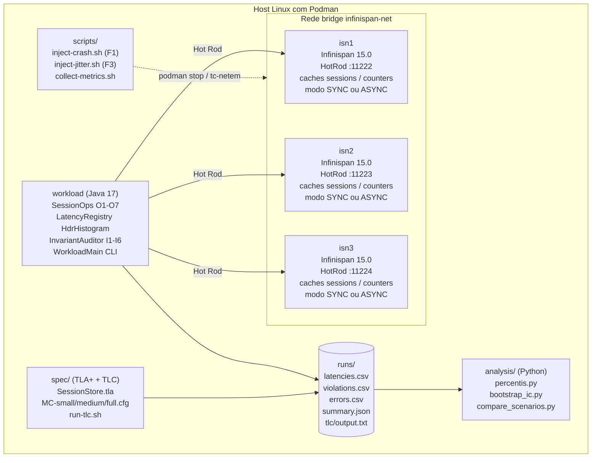

# Planejamento Inicial do Desenvolvimento Prático do TCC

> Primeira entrega do fluxo de desenvolvimento prático, produzida em 2026-05-25. A execução de qualquer tarefa técnica depende da aprovação prévia do autor.
>
> **Nota de revisão (2026-06-14):** o §"Objetivo do projeto prático", o §"Estado atual do repositório", o §"Backlog inicial" e o §"Pontos que precisam de validação do autor" foram atualizados após a discussão entre os agentes Senior e Worker registrada em `/workspace/memoria-tcc/24-discussao-senior-worker-objetivo-2026-06-14.md` (Rodada 6) e após a entrada em vigor da política de *push* aprovada pelo autor na mesma data: nada vai para o repositório remoto sem aprovação explícita. O diagrama de arquitetura também foi convertido de ASCII-art para Mermaid. O texto original de cada seção alterada está preservado em `/workspace/memoria-tcc/24-discussao-senior-worker-objetivo-2026-06-14.md` (Rodada 1).

## Objetivo do projeto prático

Construir e disponibilizar os artefatos executáveis e reproduzíveis que sustentam o Capítulo 4 da monografia, com cinco entregas mutuamente dependentes:

1. **Especificação formal:** *spec* TLA+ `SessionStore.tla` cobrindo as operações O1-O7 e os invariantes I1-I6, verificada pelo TLC nas três configurações T21 da Tabela 1 do Cap. 3 §3.3.5.
2. **Infraestrutura experimental:** *cluster* Infinispan parametrizado por T1-T4, T15 e T16 da Tabela 1, admitindo execução nos modos `DIST_SYNC` e `DIST_ASYNC`.
3. **Programa de carga:** *workload* Java sobre Hot Rod com O1-O7, auditor de invariantes (I1-I4 com checagem imediata, I5-I6 com auditoria periódica em quiescência) e instrumentação de latência via HdrHistogram.
4. **Pipeline de análise:** *scripts* Python para p50/p95/p99, IC *bootstrap* e Mann-Whitney, validados em dados sintéticos.
5. **Scripts de injeção de falha:** F1 e F3 escritos e revisados, com execução condicionada a ambiente com Podman e `NET_ADMIN` disponíveis.

A **meta TCC-I** é o conjunto (1) a (4) executado e os *scripts* (5) prontos para revisão. O ***baseline* experimental F1+F3 com dados reais** é entregável condicional, com duas saídas: execução pelo autor em infraestrutura própria com incorporação à monografia em revisão posterior, ou reposicionamento para a primeira etapa de TCC-II (Apêndice B da monografia).

**Histórico:** a formulação original (2026-05-25) previa o *baseline* F1+F3 como entregável obrigatório de TCC-I. A revisão de 2026-06-14 ajustou esse ponto após constatação operacional de que o *sandbox* de execução não admite Podman nem `tc-netem`. A frente formal (item 1) foi executada com cinco rodadas do TLC e a sonda na configuração `MC-full` explorou aproximadamente 91 milhões de estados sem violação para I3 e I4; contraexemplos curtos foram registrados para I1, I2, I5 e I6.

## Relação com o TCC

O TCC está estruturado em cinco capítulos. As decisões de implementação derivam diretamente de:

- **Cap. 1 §1.2 (Problema de pesquisa)** — define a questão central de especificar e verificar invariantes de sessão em *data grids* sob replicação assíncrona e falhas.
- **Cap. 3 §3.3.1 (Operações modeladas)** — fixa O1 a O7 com pré-condições, efeitos e códigos de retorno.
- **Cap. 3 §3.3.2 (Modelo de falhas)** — fixa F1 e F3 como obrigatórias para TCC-I; F2 e F4 ficam para TCC-II.
- **Cap. 3 §3.3.3 (Invariantes-alvo)** — I1 a I6, com I1 a I4 verificáveis no modelo formal inicial e I5 a I6 sob quiescência.
- **Cap. 3 §3.3.4 (Métricas e critérios)** — M1 a M7, com latência por operação, taxa de violação, tempo de recuperação, tempo de convergência, taxa de erro e métricas sistêmicas via Infinispan Metrics.
- **Cap. 3 §3.3.5 (Parâmetros experimentais)** — Tabela 1 com os 22 parâmetros do *baseline* e suas fontes bibliográficas; é o **contrato** que o protótipo deve realizar.
- **Cap. 4 §4.1 (Arquitetura experimental)** — define `DIST_SYNC` e `DIST_ASYNC` como modos de execução, `numOwners=2`, *containers* Podman, `tc-netem` para F3.
- **Cap. 4 §4.4 (Estado dos artefatos)** — o Cap. 4 declara que `/workspace/prototipo/` contém o *esqueleto* dos três artefatos (compose, *workload*, spec TLA+) ao fim da Semana 8.

A consequência operacional: a Tabela 1 do Cap. 3 §3.3.5 é o **especificação executável** do *baseline*; o desenvolvimento prático no repositório `tcc-desenvolvimento` precisa realizar cada linha T1 a T22 de forma observável.

## Estado atual do repositório

Atualizado em 2026-06-14.

- *Checkout* local em `/workspace/tcc-desenvolvimento/`. Remoto: `origin = https://github.com/franpgn/tcc-desenvolvimento.git`.
- Política de *push* desde 2026-06-14: **nada vai para `origin/*` sem aprovação explícita do autor** (D-006 do §"Pontos que precisam de validação do autor" rejeitada nesta data).
- **Sete PRs já no remoto** (mergidos antes da revisão de política): #1 (B-02 cluster SYNC), #2 (B-03 cluster ASYNC), #3 (B-14 spec TLA+), #4 (B-04 workload skeleton), #5 (MC rodada 1), #6 (MC rodadas 2-5), #7 (B-16/17/18 análise Python).
- **Um PR aberto no remoto** (sob política antiga, antes de 2026-06-14): PR #8 (B-05 `OpResult`), aguardando revisão e *merge* do autor.
- **Três** ***branches*** **locais sem** ***push***: `feature/workload-operations` (B-05, espelho do PR #8), `feature/workload-latency` (B-05+B-06), `feature/workload-auditor` (B-05+B-06+B-07). Cada uma adiciona um *commit* sobre a anterior; servem como cadeia de *stacked PRs* quando o autor liberar *push*.
- ***Branch*** **corrente (HEAD):** `docs/objetivo-revisao` (esta revisão do planejamento).
- **Frente formal:** executada. Cinco rodadas do TLC concluídas; resultados em `runs/tlc/`.
- ***Sandbox*** **operacional:** OpenJDK Temurin 17, Maven 3.9.9, TLA+ tools, Python 3.11 + numpy + scipy em `~/tools/`. **Não disponível no** ***sandbox:*** Podman (impossibilidade de `unshare(CLONE_NEWUSER)`), `tc-netem` com `NET_ADMIN`, imagem `quay.io/infinispan/server:15.0`. Atividades dependentes ficam para a máquina do autor.

## Esqueleto pré-existente em `/workspace/prototipo/` (referência, não modificar)

O Cap. 4 §4.4 da monografia declara como entregue ao fim da Semana 8 um esqueleto que **pertence à estrutura do TCC** e, portanto, não é modificado pelo trabalho neste repositório. O esqueleto tem o seguinte estado:

| Caminho | Tipo | Estado |
|---|---|---|
| `podman-compose.yml` | Orquestração | 3 nós `quay.io/infinispan/server:15.0`, rede `infinispan-net`, *health check* via `/rest/v2/.../health/status`, portas 11222/11223/11224 |
| `cluster/infinispan-cluster.xml` | Configuração de *cache* | *Caches* `sessions` e `counters` em `DIST_SYNC`, `owners=2`, `segments=64`, `partition-handling=DENY_READ_WRITES`, `merge-policy=PREFERRED_NON_NULL` |
| `workload/pom.xml` | Maven | Esqueleto Java 17 (sem dependência Hot Rod efetiva ainda) |
| `workload/src/.../session/*.java` | Java | Seis classes-esqueleto: `SessionState`, `IdentityState`, `LatencyRegistry`, `InvariantAuditor`, `SessionOps`, `WorkloadMain` (sem lógica de conexão Hot Rod nem execução real) |
| `spec/SessionStore.tla` | TLA+ | Operações `Login`, `Logout`, `IncrementFailure`, `Block` + `EntregaMensagem`; invariantes I1, I2, I3, I4. **Faltam:** `Validate`, `ResetFailures`, `Unblock`, e os invariantes de convergência I5/I6 sob quiescência |
| `spec/SessionStore.cfg` | Config TLC | Presente (não inspecionado nesta etapa) |
| `scripts/` | Vazio | Scripts de injeção de F1/F3 ainda não criados |

**Decisão proposta ao autor (D-001):** o repositório `tcc-desenvolvimento` **espelha e evolui** o esqueleto de `/workspace/prototipo/`. A migração inicial copia o conteúdo e organiza segundo o padrão de repositório Git; a partir daí, todo desenvolvimento ocorre exclusivamente em `tcc-desenvolvimento/`, e `prototipo/` fica congelado como *snapshot* coerente com o texto entregue do Cap. 4 §4.4. O caminho alternativo (recomeçar do zero em `tcc-desenvolvimento`) implica retrabalho sem ganho técnico e desalinha texto e código.

## Tecnologias identificadas

| Camada | Tecnologia | Versão prevista | Fonte no TCC |
|---|---|---|---|
| Servidor de *data grid* | Infinispan Server | 15.0 (`quay.io/infinispan/server:15.0`) | Cap. 4 §4.1; `podman-compose.yml` |
| Cliente | Hot Rod (cliente Java oficial) | alinhada ao servidor 15.0 | Cap. 4 §4.1 |
| Linguagem do *workload* | Java | 17 (LTS) | `prototipo/workload/pom.xml` |
| Build | Maven | 3.9+ | idem |
| Containerização | Podman + podman-compose | última estável | Cap. 4 §4.1 |
| Especificação formal | TLA+ + TLC | `tla2tools.jar` | Cap. 4 §4.2; Cap. 3 §3.3.5 T21 |
| Métricas | OpenMetrics endpoint do servidor | nativo do Infinispan 15 | Cap. 3 §3.3.4; REF-008 |
| Injeção de falha F1 | `podman stop` / `podman pause` | nativo | Cap. 3 §3.3.2 / Cap. 4 §4.3 |
| Injeção de falha F3 | `tc qdisc … netem delay lognormal` | Linux iproute2 | idem |
| Análise estatística | Python + NumPy/SciPy ou R | a definir (P-011/CAND-020) | Cap. 3 §3.3.5 T22 |

**Pontos abertos (P-A1).** Plataforma do *workload* foi fixada em Java/Hot Rod pelo Cap. 4; manter. **Pontos abertos (P-A2).** Linguagem de análise estatística não está fixada no texto — *default* sugerido: Python (SciPy + Matplotlib). Decisão do autor.

## Arquitetura inicial proposta

A arquitetura é **horizontal** sobre o servidor Infinispan (três nós comunicando-se em *cluster* via JGroups) e **vertical** entre três camadas de software: especificação formal, execução experimental e análise estatística. A integração entre as três camadas é assíncrona e baseada em arquivos.

A integração entre camadas materializa-se em arquivos: o *workload* escreve `runs/<scenario>/<rep>/{latencies.csv, violations.csv, errors.csv}`; o `analysis/` consome esses arquivos e produz `runs/<scenario>/summary.json` com p50, p95, p99, IC *bootstrap* e taxa de violação por invariante (M2); o `spec/` produz separadamente `runs/tlc/<config>/output.txt` com o veredito do *model checker* e os contraexemplos quando existirem.

## Módulos previstos

| Módulo | Propósito | Origem | Estado planejado em TCC-I |
|---|---|---|---|
| `cluster/` | Configuração do Infinispan e do `podman-compose` | espelho do `prototipo/` | executável |
| `workload/` | *Workload* Java com Hot Rod, O1-O7, auditor de invariantes, registro de latência | espelho do `prototipo/` + implementação dos *stubs* | executável; cobre Cenário S1 (50/50) e S2 (95/5) |
| `scripts/` | *Shell scripts* de injeção de falha, *warmup*, coleta | novo | F1 + F3 prontos; F2 + F4 *placeholders* |
| `spec/` | Especificação TLA+ + cfg TLC + *script* de execução | espelho do `prototipo/` + complementos (O2, O5, O7; I5, I6 sob quiescência) | TLC executável em 3 configurações (2-2-2, 3-3-2, 3-3-3) |
| `analysis/` | *Scripts* Python de parsing, percentis e *bootstrap* | novo | gera `summary.json` por cenário |
| `runs/` | Saídas brutas e consolidadas dos experimentos | gerado em tempo de execução | versionado por *git-lfs* opcional ou ignorado conforme decisão do autor (P-A3) |
| `docs/` | Documentação técnica (este planejamento, arquitetura, *backlog*, testes, decisões, *roadmap*) | novo | completo ao fim do TCC-I |
| `.github/` | *Workflows* CI opcionais (lint Java, *mvn verify*, validação de TLC) | novo, opcional | a decidir (P-A4) |

## Backlog inicial

Cada item do *backlog* é uma *issue* candidata; cada um vira `feature/<nome>` quando aprovado pelo autor. A ordem reflete dependências técnicas, não prioridade absoluta.

| ID | Item | Branch sugerida | Cobertura na Tabela 1 do Cap. 3 §3.3.5 |
|---|---|---|---|
| B-01 | *Bootstrap* do repositório: `README.md`, `.gitignore`, `LICENSE`, `docs/` inicial, `CONTRIBUTING.md` mínimo | `feature/bootstrap-repo` | — |
| B-02 | Migração do `cluster/` (compose + xml) do `prototipo/` para `tcc-desenvolvimento/` | `feature/cluster-infinispan` | T1, T2, T3, T4, T15, T16 |
| B-03 | Configuração de variante `DIST_ASYNC` do *cache* `sessions` (perfil alternativo do XML) | `feature/cluster-async` | T1 (modo alvo) |
| B-04 | Migração do esqueleto Java do *workload* + dependências Hot Rod efetivas | `feature/workload-bootstrap` | — |
| B-05 | Implementação de O1-O7 com chamada Hot Rod real e códigos de retorno | `feature/workload-operations` | T7 |
| B-06 | `LatencyRegistry` com HdrHistogram + dump CSV | `feature/workload-latency` | T13, T14 |
| B-07 | `InvariantAuditor` com checagem imediata I1-I4 + auditoria periódica para I5/I6 | `feature/workload-auditor` | M2 |
| B-08 | Gerador de carga com Zipfian (`ρ=0,99`), 100 000 chaves, *payload* 1 KB | `feature/workload-load` | T5, T6, T8, T9 |
| B-09 | *Warm-up* (60 s ou 10 %) + descarte das primeiras 5 % das amostras | `feature/workload-warmup` | T11 |
| B-10 | CLI parametrizada: cenário, duração, *target throughput*, repetições | `feature/workload-cli` | T10, T12, T14 |
| B-11 | `scripts/inject-crash.sh` (F1 via `podman stop` por 60 s) | `feature/falha-f1-crash` | T17 |
| B-12 | `scripts/inject-jitter.sh` (F3 via `tc netem` lognormal +50 ms p99) | `feature/falha-f3-jitter` | T18 |
| B-13 | Coletor de métricas OpenMetrics (snapshot a cada 5 s) | `feature/metrics-collector` | T19, T20 |
| B-14 | Migração do `spec/SessionStore.tla` + complemento (O2, O5, O7 e I5/I6) | `feature/spec-completa` | T21 |
| B-15 | `spec/run-tlc.sh` com três configurações (2-2-2, 3-3-2, 3-3-3) | `feature/spec-tlc-runner` | T21 |
| B-16 | `analysis/parse_logs.py` + `analysis/percentis.py` (p50, p95, p99) | `feature/analysis-percentis` | T13 |
| B-17 | `analysis/bootstrap_ic.py` (IC 95 % por *bootstrap* 10 000) | `feature/analysis-bootstrap` | T22 |
| B-18 | `analysis/compare_scenarios.py` (Mann-Whitney pareado por percentil) | `feature/analysis-mwu` | T22 |
| B-19 | Pipeline de execução *end-to-end* (`scripts/run-baseline.sh`) | `feature/pipeline-baseline` | integra T9-T14, T17, T18 |
| B-20 | Documentação consolidada: `README.md`, `docs/configuracao-infinispan.md`, `docs/implementacao.md`, `docs/testes.md` | `docs/consolidacao-final` | — |

## Ordem sugerida de implementação

1. **Bloco fundação:** B-01 → B-02 → B-04. Resultado: repositório com *cluster* configurado e esqueleto Java migrado.
2. **Bloco execução nominal:** B-05 → B-06 → B-08 → B-09 → B-10. Resultado: *workload* roda contra `DIST_SYNC` e produz CSV de latência sem falhas.
3. **Bloco auditoria:** B-07 → B-13. Resultado: violações de I1-I4 e métricas de RPC são registradas.
4. **Bloco falhas:** B-03 (perfil ASYNC) → B-11 (F1) → B-12 (F3). Resultado: cenários completos S1/S2 × {sem-falha, F1, F3} × {SYNC, ASYNC} reproduzíveis.
5. **Bloco formal:** B-14 → B-15. Resultado: TLC executa três configurações; vereditos no `runs/tlc/`.
6. **Bloco análise:** B-16 → B-17 → B-18. Resultado: `summary.json` por cenário com percentis, IC e Mann-Whitney.
7. **Bloco entrega:** B-19 → B-20. Resultado: pipeline `run-baseline.sh` executa todo o experimento; documentação consolidada.

Em paralelo: **resumo técnico para o TCC** a cada bloco fechado, dentro de `docs/resumos-para-tcc/`, para alimentar a escrita acadêmica.

## Critérios de aceite (gerais)

Aplicáveis a todo item do *backlog* antes da entrega ser considerada concluída:

1. **Reprodutibilidade.** Comando único documentado executa a *feature*. Versão da imagem e *checksum* fixados.
2. **Aderência ao Cap. 3 §3.3.5.** Cada *feature* mapeia explicitamente para a(s) linha(s) Tx que ela realiza.
3. **Testes.** *Smoke test* mínimo (script ou JUnit) demonstrando que a *feature* funciona ponta-a-ponta.
4. **Documentação.** Atualização de `docs/implementacao.md` e `docs/decisoes-tecnicas.md` com cada decisão não-trivial.
5. **Versionamento.** Commits no padrão `<tipo>: <descrição>`. *Branch* da *feature*. Sem *force-push*.
6. **Nenhum efeito colateral em `/workspace/prototipo/` ou em `/workspace/*.tex`.**

Critérios específicos por *feature* são detalhados em `docs/criterios-de-aceite.md` (a criar quando este planejamento for aprovado e B-01 for expandido).

## Riscos técnicos

| Risco | Probabilidade | Impacto | Mitigação |
|---|---|---|---|
| R-01: cliente Hot Rod 15.0 incompatível com Maven Central no *sandbox* | Média | Alto (bloqueia B-04) | Fixar `<repositories>` do Red Hat GA; *vendor* opcional via `mvn dependency:go-offline` |
| R-02: `tc netem` exige `NET_ADMIN` no *container* alvo | Alta | Alto (bloqueia F3) | Aplicar `tc` no *host*, na interface de *bridge*, ou conceder `--cap-add=NET_ADMIN` ao serviço afetado |
| R-03: *clusterização* falha em `DIST_ASYNC` sob carga alta | Média | Médio (afeta B-03) | *Health check* já presente; ajustar `state-transfer.timeout` se necessário; documentar como limitação se persistir |
| R-04: TLC explode espaço de estados em configuração 3-3-3 | Média | Médio (afeta B-15) | Cardinalidades em escada (REF-018); aceitar `3-3-2` como teto se 3-3-3 ultrapassar 30 min |
| R-05: Volume de saída do *workload* (10⁶ ops × 30 reps × N cenários) | Média | Médio | Compactação LZ4 ou *streaming aggregation* dentro do `LatencyRegistry`; descartar latências brutas após agregação |
| R-06: tempo de execução total acima do disponível | Média | Alto | Reduzir repetições para piloto (5) antes da rodada final (30); cenários executados sob fim de semana |
| R-07: política de *push* desde 2026-06-14 exige aprovação explícita do autor a cada *push* (D-006 rejeitada) | Alta | Baixo (o autor executa) | Pedir aprovação ao autor por entrega individual ou em lote por *branch*; nunca tentar `push` no fluxo automatizado |

## Pontos que precisam de validação do autor

Status consolidado em 2026-06-14.

- ✅ **D-001 (aprovada).** Migração do esqueleto `/workspace/prototipo/ → /workspace/tcc-desenvolvimento/` em vez de *bootstrap* limpo.
- ✅ **D-002 (aprovada).** Java 17 + Maven como *toolchain* obrigatório do *workload*.
- ✅ **D-003 (aprovada).** Python (NumPy + SciPy) como *toolchain* da camada `analysis/`. Matplotlib opcional.
- ✅ **D-004 (aprovada).** `main` como linha de entrega; *feature branches* por item do *backlog*; sem *develop* intermediária.
- ✅ **D-005 (aprovada).** `runs/` em `.gitignore` com agregados (`summary.json`) versionados; sem Git LFS.
- ❌ **D-006 (rejeitada em 2026-06-14).** O *push* para `origin/*` requer aprovação explícita do autor a cada vez, por entrega individual ou em lote por *branch* trabalhada, como o Senior achar melhor. Os PRs #1 a #8 já no remoto datam da política anterior (Decisão 014 de 2026-05-25) e ficam como histórico. Daqui em diante, qualquer *commit*, *branch* ou PR fica local até pedido + aprovação.
- ✅ **D-007 (aprovada e executada).** B-01 iniciado e concluído em 2026-05-26.
- ✅ **D-008 (aprovada).** Análise estatística (B-16 a B-18) é entregável de TCC-I; executada e validada em dados sintéticos.
- ✅ **D-009 (aprovada).** Ambas as variantes (`DIST_SYNC` e `DIST_ASYNC`) entram no *baseline* de TCC-I quando este for executado; o modo alvo é `DIST_ASYNC`, e `DIST_SYNC` serve como controle de sanidade.

## Próxima tarefa técnica

A próxima tarefa do *backlog* é **B-08, Gerador de carga Zipfian**, na *branch* `feature/workload-load` (a criar a partir de `feature/workload-auditor`), com o seguinte escopo:

1. Implementar um gerador de chaves Zipfian com parâmetro $\rho = 0{,}99$, conforme T6 da Tabela 1 do Cap. 3 §3.3.5.
2. Universo de 100\,000 chaves distintas (T8), com nomes determinísticos para reprodução exata entre rodadas (`sid-000001` a `sid-100000`).
3. *Payload* fixo de 1\,KiB por entrada (T5), composto por *string* determinística (não aleatória) para evitar dependência de entropia entre rodadas.
4. Mistura de operações configurável: cenário **S1** = 50/50 *reads*/*writes*; cenário **S2** = 95/5 (T7).
5. Integração com `WorkloadMain.rodarCliente()` via parâmetro CLI `--scenario` (preparando a CLI completa de B-10).
6. Testes JUnit para: (a) distribuição empírica em $10^6$ amostras com erro relativo abaixo de 5\,% nos primeiros 100 *bins*, (b) reprodutibilidade entre dois `KeyGenerator` com mesma seed, (c) cobertura efetiva do universo de chaves em $10^6$ amostras.
7. ***Commit*** **local apenas.** Sem *push*. Aprovação para *push* é pedida ao autor após o término de B-08 (e, opcionalmente, junto com B-09 e B-10 em lote).

**Critérios de aceite específicos de B-08:**

- `mvn test` passa para os três testes acima na *branch* `feature/workload-load`.
- `mvn package` produz o *jar* combinado com a nova classe `KeyGenerator`.
- A `KeyGenerator` documenta a seleção de parâmetros em comentário JavaDoc remetendo a T5, T6 e T8 da Tabela 1.
- Nenhum efeito colateral em `/workspace/prototipo/`, `/workspace/*.tex` ou nas três *branches* prévias.
