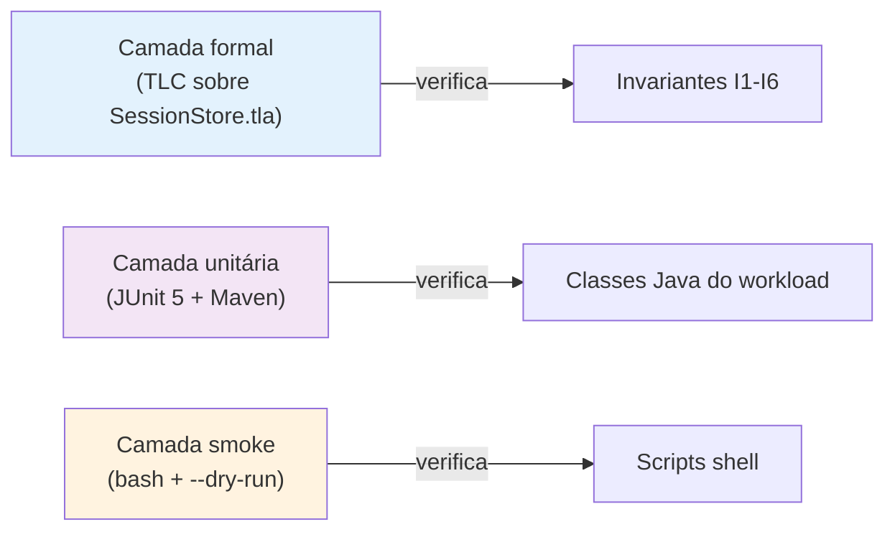

# Estratégia e cobertura de testes

> Como o repositório verifica que cada bloco do *backlog* atende ao critério de aceite correspondente em [`criterios-de-aceite.md`](criterios-de-aceite.md). Mapeia os três níveis de teste (unitário, *smoke*, formal) e quais classes são alvo de cada um.

## Estratégia em três camadas



A escolha das três camadas é proposital. A camada formal cobre a especificação que existe independentemente do código (TLC verifica o protocolo abstratamente, sem precisar de cluster). A camada unitária cobre o código Java do *workload* sem dependência de cluster Infinispan, sandbox ou rede. A camada *smoke* cobre os *scripts* de orquestração, que dependem de Podman, `tc` e `curl` mas têm `--dry-run` que valida o plano sem executar.

## Camada formal — TLA+ / TLC

| Configuração | Cardinalidade (IDS, SIDS, REPLICAS) | Tempo esperado |
|---|---|---|
| `MC-small.cfg` | 2, 3, 2 | segundos |
| `MC-medium.cfg` | 3, 3, 2 | minutos |
| `MC-full.cfg` | 3, 3, 3 | dezenas de minutos (estourou em 91 M estados sem violação para I3/I4) |

Como rodar:

```bash
cd spec
./run-tlc.sh small    # primeira passada
./run-tlc.sh medium
./run-tlc.sh full     # configuração ampliada
```

A saída de cada rodada vai para `runs/tlc/<size>/output.txt`. Contraexemplos curtos foram identificados para I1, I2, I5 e I6 em todas as configurações; I3 e I4 não foram violados em nenhuma das cinco rodadas conduzidas até 2026-05-27.

## Camada unitária — JUnit 5 (Maven)

Como rodar todos os testes:

```bash
cd workload
mvn test
```

Estado em 2026-06-14: 34 testes em 6 classes.

| Classe testada | Arquivo de teste | Testes | Cobertura |
|---|---|---|---|
| `KeyGenerator` | `KeyGeneratorTest.java` | 6 | distribuição empírica (< 5\,\% erro nos primeiros 100 *bins*); reprodutibilidade; cobertura > 30\,\% em $10^6$; formato `sid-NNNNNN`; intervalo $[1, n]$; rejeição de inválidos |
| `Scenario` | `ScenarioTest.java` | 3 | distribuição S1 (50/25/10/10/5) e S2 (95/3/1/1/0) com < 2\,\% de erro; `porNome` aceita variações |
| `WarmupPolicy` | `WarmupPolicyTest.java` | 7 | aritmética para 60\,s, 600\,s e 1800\,s; predicados de fase mutuamente exclusivos; `Clock` injetável; `always()`, `never()`; rejeição de duração negativa |
| `Cli` | `CliTest.java` | 9 | *defaults* batem com Tabela 1; opções curtas e longas; `--servers`; numéricos; `--dry-run`; `--csv-dir`; validação rejeita e aceita; `toString` não expõe senha |
| `LatencyRegistry` | `LatencyRegistryTest.java` | 4 | precisão de percentis; CSV bem formado; `WarmupPolicy.never()` descarta todas; transição `never→always` descarta apenas o intervalo anterior |
| `InvariantAuditor` | `InvariantAuditorTest.java` | 5 | registro e contagem de violações; auditoria periódica em *thread* |

## Camada *smoke* — *scripts* `bash` com `--dry-run`

Todos os *scripts* têm `--help` e `--dry-run`. O `--dry-run` imprime o plano (comandos, parâmetros, estrutura de saída) sem executar nada, o que permite validar argumentos sem dependência de Podman, `tc` ou cluster vivo.

| Script | Suíte mínima | Comando |
|---|---|---|
| `scripts/inject-crash.sh` | help, dry-run, validação de `--duration -1` | `./scripts/inject-crash.sh --dry-run --node isn1 --duration 90` |
| `scripts/inject-jitter.sh` | help, dry-run, validação de `--distribution xyz` | `./scripts/inject-jitter.sh --dry-run --iface podman0` |
| `scripts/collect-metrics.sh` | help, dry-run, validação de `--interval 0` | `./scripts/collect-metrics.sh --dry-run --interval 5 --duration 300` |
| `scripts/run-baseline.sh` | help, dry-run, validação de `--falhas Fxx`, contagem de combinações | `./scripts/run-baseline.sh --dry-run --scenarios S1 --falhas none,F1 --rep 3 --duration 60` |

Sintaxe Bash é validada por `bash -n <script>` antes de cada *commit* relevante; nenhuma das suítes depende de Podman, `tc` ou cluster ativo.

## Pipeline da camada de análise (Python)

A camada `analysis/` foi validada contra 750\,000 operações sintéticas geradas por `analysis/gerar_dados_sinteticos.py`. Os resultados ficaram em `analysis/exemplo-pipeline/` e cobrem:

- `percentis.py`: agregação por cenário em `summary.json` com p50, p95, p99, p999.
- `bootstrap_ic.py`: IC 95\,\% por percentil com 10\,000 reamostragens.
- `compare_scenarios.py`: Mann-Whitney pareado entre dois cenários, p-valor por op + percentil.

Como reproduzir o exemplo:

```bash
~/tools/venv/bin/python analysis/percentis.py analysis/exemplo-pipeline/S1-sem-falha
~/tools/venv/bin/python analysis/compare_scenarios.py \
    analysis/exemplo-pipeline/S1-sem-falha \
    analysis/exemplo-pipeline/S1-F1
```

## O que ainda não é testado

- **Workload contra cluster vivo**: requer Podman + cluster levantado. Não há teste automatizado neste nível; a validação será feita na execução do *baseline* na máquina do autor.
- **Injeção real de F1 e F3**: `inject-crash.sh` e `inject-jitter.sh` têm *smoke-test* mas não foram exercidos contra ambiente com Podman e `NET_ADMIN`.
- **Cobertura de código** (linha por linha): JaCoCo não foi configurado. Decisão a posteriori se o autor entender que a cobertura é métrica relevante.

## Critério de aprovação por bloco do *backlog*

Cada bloco do *backlog* só é considerado "concluído" quando, simultaneamente:

1. `mvn test` passa para os testes JUnit da camada afetada.
2. `bash -n <script>` (sintaxe) e `<script> --dry-run` rodam sem erro para os *scripts* da camada afetada.
3. `mvn package` produz o *jar shaded* sem erro.
4. Para blocos que envolvem TLA+: `./run-tlc.sh small` fecha sem contraexemplo inesperado para os invariantes mantidos.
5. A documentação técnica relevante (este arquivo, `implementacao.md`, `configuracao-infinispan.md` ou `resumos-para-tcc/`) está atualizada.

Detalhes por bloco em [`criterios-de-aceite.md`](criterios-de-aceite.md).
